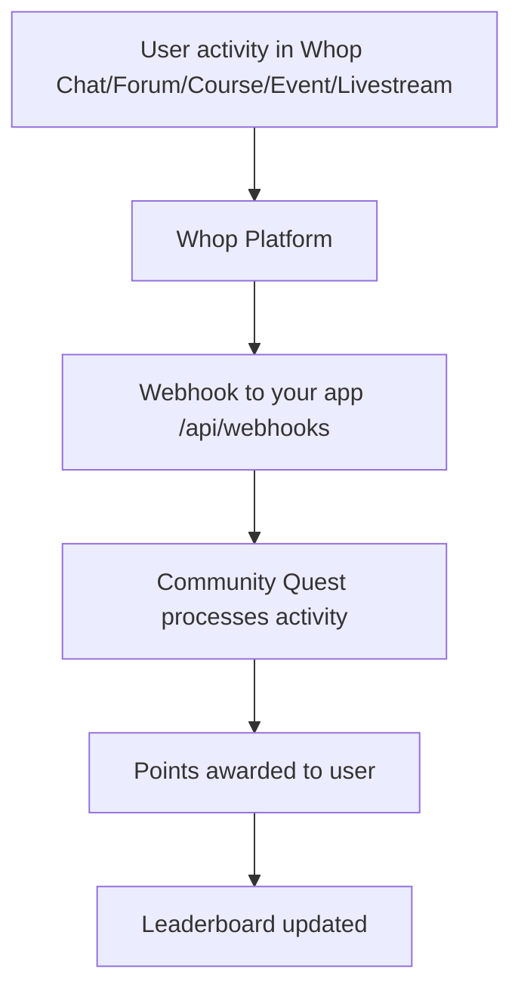
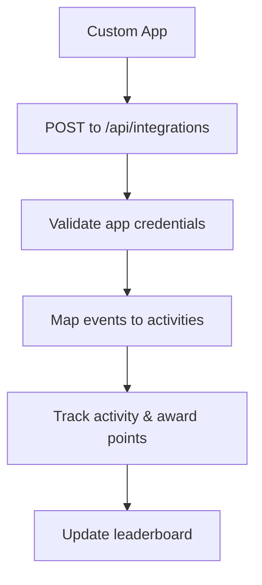

# 🔗 Whop App Integration Guide

This guide explains how to integrate your Community Quest app with actual Whop apps and clarifies which apps are available.

## 📱 Available Whop Apps

Whop provides these standard apps that can be integrated with Community Quest:

### ✅ **Actually Available Whop Apps:**

1. **Chat App** (`chat_app`)
   - Real-time group discussions
   - Supports messages, replies, reactions, and streaks
   - Events: `message_sent`, `message_replied`, `discussion_started`, `reaction_received`, `streak_achieved`

2. **Forum App** (`forum_app`)
   - Threaded conversations for in-depth discussions
   - Supports posts, replies, and engagement tracking
   - Events: `post_created`, `post_replied`, `post_pinned`, `helpful_reaction`, `high_engagement`

3. **Course App** (`course_app`)
   - Multi-lesson learning with videos, quizzes, and progress tracking
   - Supports module completion and course progression
   - Events: `module_completed`, `course_completed`, `quiz_excellent`, `progress_shared`

4. **Events App** (`event_app`)
   - Live or in-person events with optional ticketing
   - Supports event attendance tracking
   - Events: `event_attended`

5. **Livestreaming App** (`livestreaming_app`) - [View App](https://whop.com/apps/app_WykcI6ivb5fOlz)
   - Live streaming with OBS integration and screen sharing
   - Interactive chat, reactions, and multiple speakers
   - Events: `stream_started`, `stream_attended`, `stream_chat_message`, `stream_reaction`, `speaker_joined`, `raised_hand`

### ❌ **Apps That DON'T Exist:**

- **"Community App"** - This is not a separate Whop app
- **"Referral App"** - Not a standard Whop app

## 🔧 How to Integrate with Whop Apps

### Step 1: Add Apps to Your Whop Community

1. **Go to your Whop Dashboard**: [dashboard.whop.com](https://dashboard.whop.com)
2. **Navigate to your community/company**
3. **Click "Add app"** to open the Whop App Store
4. **Browse and add the apps you want**:
   - Chat
   - Forums
   - Course
   - Events
   - Livestreaming

### Step 2: Configure Webhook Integration

#### For Standard Whop Apps (Recommended Approach):

**Use Whop's built-in webhook system:**

1. **Set up webhooks in your Whop app** (not individual apps):
   - Go to your Whop app settings → Webhooks
   - Set webhook URL to: `https://your-domain.com/api/webhooks`
   - Enable these events:
     - `chat.message_sent`
     - `chat.message_replied`
     - `chat.discussion_started`
     - `chat.reaction_received`
     - `chat.streak_achieved`
     - `forum.post_created`
     - `forum.post_replied`
     - `forum.post_pinned`
   - `course.module_completed`
   - `course.completed`
   - `event.attended`
   - `livestream.started`
   - `livestream.attended`
   - `livestream.chat_message`
   - `livestream.reaction`
   - `livestream.speaker_joined`
   - `livestream.raised_hand`
   - `user.created`

2. **Your existing webhook handler** (`/api/webhooks`) will automatically receive these events

#### For Custom Integrations (Advanced):

If you need custom functionality not covered by standard Whop apps:

1. **Build a custom app** using Whop's developer tools
2. **Use the integration API** (`/api/integrations`) with custom app credentials
3. **Set up environment variables** for your custom apps

## 🔑 Environment Variables Setup

### For Standard Whop Apps:
```bash
# Your main Whop app credentials (already set up)
NEXT_PUBLIC_WHOP_APP_ID=app_your_app_id_here
WHOP_API_KEY=whop_live_your_api_key_here
NEXT_PUBLIC_WHOP_AGENT_USER_ID=user_your_user_id_here
NEXT_PUBLIC_WHOP_COMPANY_ID=company_your_company_id_here
WHOP_WEBHOOK_SECRET=whsec_your_webhook_secret_here
NEXT_PUBLIC_APP_URL=https://your-app-url.com
```

### For Custom Integrations (Optional):
```bash
# Only if you have custom apps with their own APIs
CHAT_APP_SECRET=your_custom_chat_app_secret
FORUM_APP_SECRET=your_custom_forum_app_secret
COURSE_APP_SECRET=your_custom_course_app_secret
EVENT_APP_SECRET=your_custom_event_app_secret
LIVESTREAMING_APP_SECRET=your_custom_livestreaming_app_secret
```

## 🚀 Integration Flow

### Standard Integration (Recommended):



### Custom Integration (Advanced):



## 📊 Supported Events

### Chat App Events:
- `message_sent` → 2 points
- `message_replied` → 3 points
- `discussion_started` → 10 points
- `reaction_received` → 5 points
- `streak_achieved` → 20 points

### Forum App Events:
- `post_created` → 15 points
- `post_replied` → 8 points
- `post_pinned` → 50 points
- `helpful_reaction` → 15 points
- `high_engagement` → 25 points

### Course App Events:
- `module_completed` → 50 points
- `course_completed` → 200 points
- `quiz_excellent` → 30 points
- `progress_shared` → 20 points

### Event App Events:
- `event_attended` → 75 points

### Livestreaming App Events:
- `stream_started` → 75 points (hosting a stream)
- `stream_attended` → 75 points (attending a stream)
- `stream_chat_message` → 2 points (chatting during stream)
- `stream_reaction` → 5 points (reacting during stream)
- `speaker_joined` → 75 points (joining as speaker)
- `raised_hand` → 75 points (participating in stream)

## 🧪 Testing Your Integration

### 1. Test Webhook Endpoint:
```bash
curl -X GET https://your-domain.com/api/integrations
```

### 2. Check Integration Status:
```bash
curl -X GET https://your-domain.com/api/integrations?app_id=chat_app
```

### 3. Test Activity Tracking:
1. Send a message in your Whop Chat
2. Create a post in your Whop Forum
3. Complete a module in your Whop Course
4. Attend an event
5. Start or attend a livestream
6. Check your Community Quest leaderboard for point updates

## 🐛 Troubleshooting

### "Community App" not found:
- ✅ This is correct - "Community App" doesn't exist as a separate Whop app
- ✅ Use individual apps (Chat, Forum, Course, Events) instead

### Integration not working:
- ✅ Verify webhook URL is accessible from internet
- ✅ Check that webhook events are enabled in your Whop app settings
- ✅ Ensure your app is properly installed in your Whop community
- ✅ Check webhook secret matches between Whop and your app

### No points being awarded:
- ✅ Verify webhook events are being received (check server logs)
- ✅ Ensure user IDs match between Whop and your app
- ✅ Check that event types are correctly mapped

## 📞 Need Help?

1. **Check Whop Documentation**: [dev.whop.com](https://dev.whop.com)
2. **Verify your app setup** in Whop Dashboard
3. **Test webhook endpoints** manually
4. **Check server logs** for integration errors
5. **Contact Whop Support** if issues persist

---

**Your Community Quest app is now properly configured to work with actual Whop apps! 🎉**
